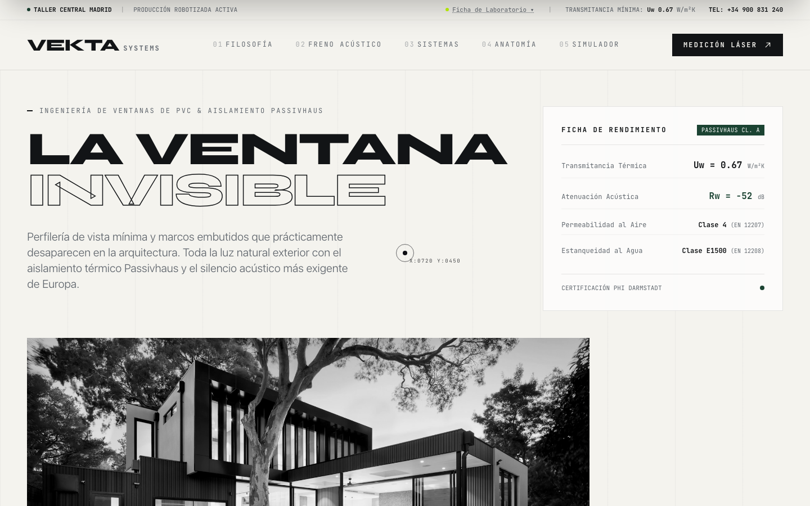
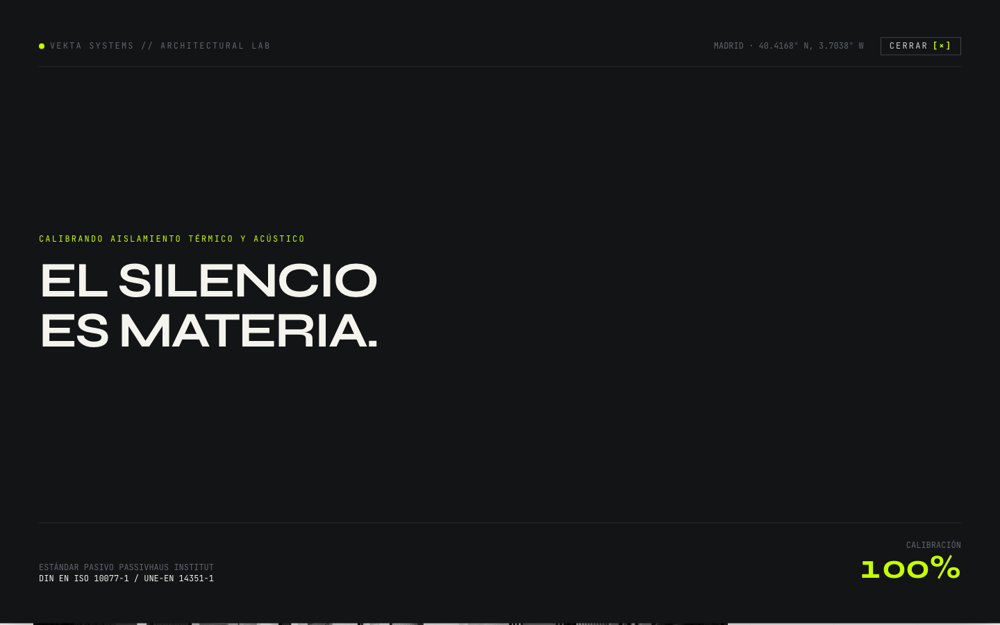
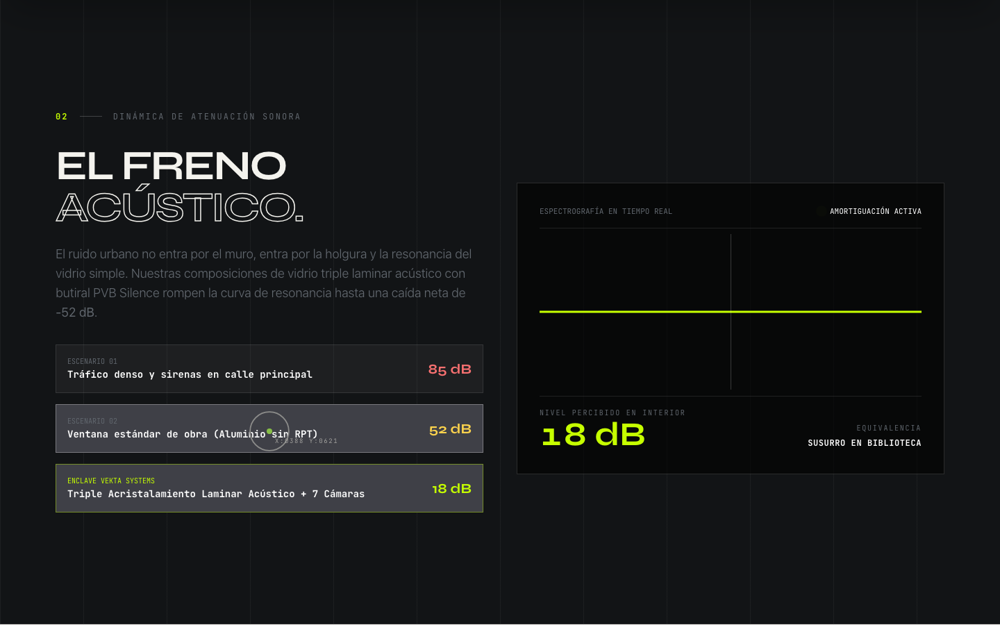
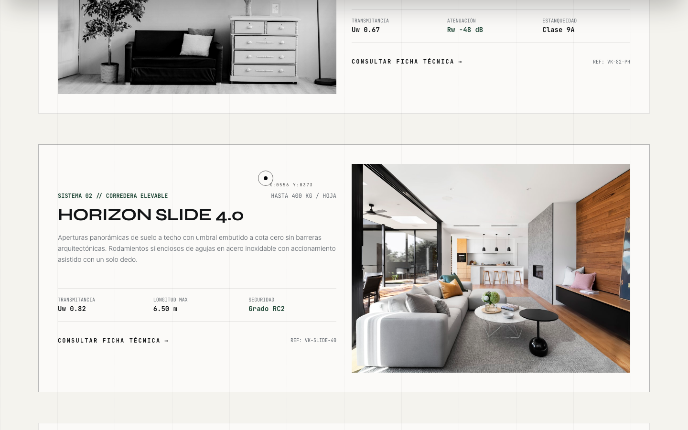
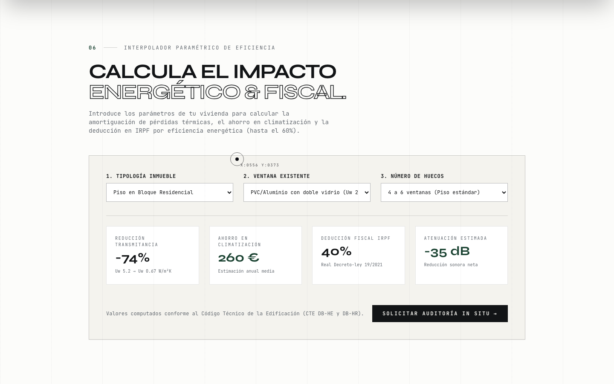
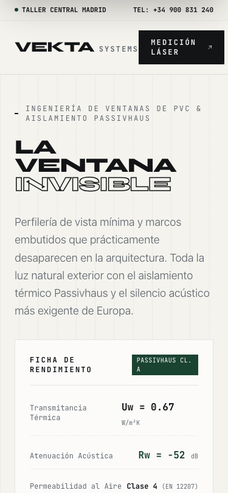

<div align="center">

# 🪟 VEKTA SYSTEMS — LA VENTANA INVISIBLE

### Tema Hijo Arquitectónico para WordPress (GeneratePress Child Theme)

[](https://vekta-ventanas.vercel.app)
[](https://generatepress.com)
[](https://generatepress.com)
[](https://greensock.com)
[](https://lenis.darkroom.engineering/)
[](https://tailwindcss.com)
[](https://www.w3.org/WAI/WCAG21/quickref/)
[](https://playwright.dev)

<br/>

> **"La Ventana Invisible: concebida con perfilería mínima y marcos embutidos que prácticamente desaparecen en la arquitectura, maximizando la entrada de luz natural y aislando por completo el frío, el calor y el ruido exterior."**

<br/>

🌐 **Despliegue en Vivo:** **[https://vekta-ventanas.vercel.app](https://vekta-ventanas.vercel.app)**  
📁 **Repositorio Oficial:** **[https://github.com/moisesvalero/vekta-ventanas](https://github.com/moisesvalero/vekta-ventanas)**

</div>

---

> [!IMPORTANT]
>
> ### 📌 Aviso de Portfolio & Demostración Técnica
>
> Este proyecto es un **desarrollo conceptual de tema hijo para WordPress (GeneratePress)** creado con fines de **portfolio profesional, diseño frontend y demostración técnica** de nivel _Awwwards / FWA / CSS Design Awards_. **Vekta Systems no es una empresa comercial activa**; las marcas, sistemas, patentes y simuladores interactivos corresponden a una maqueta técnica de alto rendimiento.

---

## 📸 Vista Previa del Proyecto

### 01. Portada Editorial & Hero Monolítico ("La Ventana Invisible")

Tipografía colosal en _Syne Display_ con interlineado ultra-apretado (0.88), outline arquitectónico de precisión, ficha técnica de transmitancia $U_w = 0.67\text{ W/m}^2\text{K}$ y rejilla visible de 12 columnas.



---

### 02. Panel Desplegable de Laboratorio (Deslizable hacia abajo al dejar el cursor arriba)

Al situar el cursor en la zona superior de la pantalla (`Y ≤ 18px`) o hacer clic en _Ficha de Laboratorio ▾_, una cortina negra arquitectónica desciende suavemente a pantalla completa (`power4.out`) para permitir la lectura pausada del manifiesto, normativas Passivhaus (_DIN EN ISO 10077-1 / UNE-EN 14351-1_) y sellos de ensayo.



---

### 03. "El Freno Acústico" (Osciloscopio Interactivo en Tiempo Real)

Visualizador acústico que amortigua una onda sónica caótica de 85 dB (tráfico urbano severo) hasta transformarla en una línea recta horizontal verde fósforo a 18 dB (silencio de biblioteca).



---

### 04. Catálogo de Carpinterías con Efecto Hover a Color (+4% Zoom)

En reposo, las imágenes se integran en escala de grises mineral de alto contraste. Al posar el cursor sobre cualquier tarjeta o fotografía, la imagen realiza una transición fluida hacia su color natural completo con un sutil reencuadre óptico. Todas las imágenes están almacenadas localmente en disco (`assets/images/`), sin enlaces rotos ni dependencias de servicios externos.



---

### 05. Interpolador Paramétrico de Eficiencia & Deducción IRPF

Simulador reactivo en JavaScript que calcula en tiempo real la reducción porcentual de transmitancia ($U_w$), el ahorro anual estimado en climatización (€/año) y la deducción fiscal en el IRPF (hasta el 60% según Real Decreto-ley 19/2021) en base a la tipología de vivienda, cerramiento existente y número de huecos.



---

### 06. Adaptación Responsive Extrema (Viewport Móvil 375px)

Composición repensada para pantallas táctiles: clamp tipográfico fluido sin desbordamiento horizontal (`scrollWidth = innerWidth = 375px`), desactivación limpia de cursores finos y adaptación de botones táctiles accesibles.

<div align="center">
  
</div>

---

## 🎨 Principios de Diseño (Cero Clichés de IA)

Este proyecto fue diseñado siguiendo un estricto filtro anti-patrones para alejarse de las plantillas genéricas de inteligencia artificial:

| Elemento Cliché Prohibido ❌                             | Solución Implementada en Vekta Systems ✅                                                                                                        |
| -------------------------------------------------------- | ------------------------------------------------------------------------------------------------------------------------------------------------ |
| Gradientes morados/azules sobre fondo oscuro             | **Paleta mineral austera**: Caliza (`#F4F3EE`), Grafito (`#121416`), Plomo (`#61676E`), Pino Passivhaus (`#1B4332`) y Fósforo (`#C6FF00`).       |
| Glassmorphism gratuito y tarjetas repetidas en grid de 3 | **Layout asimétrico editorial** con roturas de rejilla de 12 columnas y fichas técnicas modulares.                                               |
| Fuentes genéricas (Inter, Roboto, Poppins o system-ui)   | **Jerarquía tipográfica tripartita**: _Syne_ (Display colosal), _Plus Jakarta Sans_ (lectura suiza) y _JetBrains Mono_ (cotas y datos técnicos). |
| Emojis utilizados como iconografía                       | **Iconografía técnica SVG pura**, marcas de cota micrométricas y cruceta láser.                                                                  |
| Hero centrado simétrico con textos de relleno            | **Composición asimétrica tensa** con copy real de ingeniería de envolvente térmica y acústica.                                                   |
| Dependencia de URLs remotas en Unsplash                  | **Autonomía total en disco**: 100% de los assets fotográficos empaquetados en [`assets/images/`](./assets/images/).                              |

---

## ⚙️ Stack Tecnológico

- **Núcleo CMS:** [WordPress](https://wordpress.org) (v6.x) + [GeneratePress](https://generatepress.com) (Tema Padre ultraligero sin bloatware).
- **Animación & Motion:** [GSAP 3.12.5](https://greensock.com) (Core, ScrollTrigger, `quickTo` para cursor láser) + [Lenis 1.1.18](https://lenis.darkroom.engineering/) para smooth scrolling desacoplado.
- **Estilos & Layout:** Tailwind CSS moderno con tokens configurados a medida (`limestone`, `graphite`, `lead`, `pine`, `laser`).
- **Despliegue Estático:** [Vercel](https://vercel.com) Edge Network (Build automático de `front-page.php` a HTML estático en CI/CD).
- **Testing & Linters:** [Playwright](https://playwright.dev) (pruebas E2E de interacción y consola limpia), [Oxlint](https://oxc.rs) y [Prettier](https://prettier.io).
- **Entorno Local:** [WordPress Playground CLI](https://wordpress.github.io/wordpress-playground/) (ejecución sin Docker ni MySQL nativo mediante WebAssembly/Node.js).

---

## 📁 Estructura del Repositorio

```text
vekta-ventanas/
├── style.css                 # Cabecera oficial del Child Theme (Template: generatepress)
├── functions.php             # Punto de entrada y carga modular
├── front-page.php            # Plantilla completa de portada Awwwards (WordPress)
├── index.php                 # Fallback estándar de WordPress
├── index.html                # Versión estática generada para Vercel
├── vercel.json               # Configuración de despliegue en Vercel
├── blueprint.json            # Configuración para WordPress Playground
├── package.json              # Dependencias y scripts de desarrollo
│
├── assets/
│   ├── images/               # Fotografías de arquitectura locales en disco (JPG alta resolución)
│   │   ├── hero-architecture.jpg
│   │   ├── sistema-vekta-82.jpg
│   │   ├── sistema-horizon-slide.jpg
│   │   ├── sistema-silence-extreme.jpg
│   │   ├── proyecto-ciudalcampo.jpg
│   │   └── proyecto-salamanca.jpg
│   ├── css/
│   │   ├── tokens.css        # Tokens CSS de diseño, elevaciones y clamp()
│   │   └── vekta.css         # Estilos específicos del tema
│   └── js/
│       └── simulator.js      # Lógica del configurador dinámico
│
├── inc/
│   ├── setup.php             # Enqueue condicional de estilos, preconnect y SEO schema
│   └── hooks.php             # Filtros de GeneratePress y optimizaciones
│
├── scripts/
│   └── build-static.mjs      # Compilador de front-page.php a HTML estático para Vercel
│
├── docs/
│   └── screenshots/          # Capturas de pantalla reales embebidas en la documentación
│
└── test-interactions.mjs     # Suite de pruebas E2E con Playwright (Desktop + Mobile)
```

---

## 🚀 Cómo Ejecutar e Instalar el Proyecto

### Opción A: Ver la Demo en Vivo en Vercel

No necesitas instalar nada. Accede directamente a la versión en producción:  
👉 **[https://vekta-ventanas.vercel.app](https://vekta-ventanas.vercel.app)**

---

### Opción B: Ejecutar en Local con WordPress Playground (Recomendado)

Gracias a WordPress Playground, puedes levantar el WordPress completo en tu máquina con Node.js sin necesidad de instalar PHP, Apache ni MySQL:

```bash
# 1. Clonar el repositorio
git clone https://github.com/moisesvalero/vekta-ventanas.git
cd vekta-ventanas

# 2. Instalar dependencias
pnpm install

# 3. Arrancar servidor WordPress local en el puerto 9400
pnpm run dev
```

El servidor iniciará automáticamente en `http://127.0.0.1:9400/`.

---

### Opción C: Instalar en un Hosting WordPress en Producción

Para desplegar este tema hijo en cualquier proveedor de hosting (Hostinger, SiteGround, Raiola, Hetzner, cPanel, Plesk, etc.):

1. En tu panel de WordPress, dirígete a **Apariencia > Temas > Añadir nuevo**.
2. Busca e instala el tema padre gratuito **GeneratePress** (_no es necesario activarlo_).
3. Sube la carpeta `vekta-ventanas` (o empaquétala en un archivo `.zip`) a `/wp-content/themes/vekta-ventanas`.
4. En **Apariencia > Temas**, activa **Vekta Ventanas (Child Theme)**.
5. ¡Listo! La plantilla [`front-page.php`](./front-page.php) tomará el control automático de la portada.

---

## 🧪 Pruebas Automatizadas y Calidad de Código

El proyecto cuenta con una batería de tests automatizados que validan:

- Carga de imágenes locales y ausencia de enlaces rotos (código HTTP 200 y `naturalWidth > 0`).
- Transición hover de escala de grises a color computado en el DOM.
- Apertura y repliegue de la cortina negra de laboratorio al situar el cursor en el margen superior.
- Reactividad del osciloscopio acústico y simulador de transmitancia térmica.
- Ausencia total de errores y advertencias en la consola de JavaScript.

```bash
# Ejecutar suite de pruebas con Playwright
pnpm test

# Ejecutar linter rápido con Oxlint
pnpm run lint

# Formatear archivos con Prettier
pnpm run format
```

---

## 📄 Licencia & Créditos

- **Desarrollo y Dirección de Arte:** Creado por [Moisés Valero](https://github.com/moisesvalero) como proyecto de portfolio frontend y arquitectura web.
- **Tema Base:** [GeneratePress](https://generatepress.com) por Tom Usborne.
- **Animaciones:** [GSAP](https://greensock.com) & [Lenis](https://lenis.darkroom.engineering/).
- **Licencia:** MIT License. Libre para uso educativo, estudio y adaptación de código.
